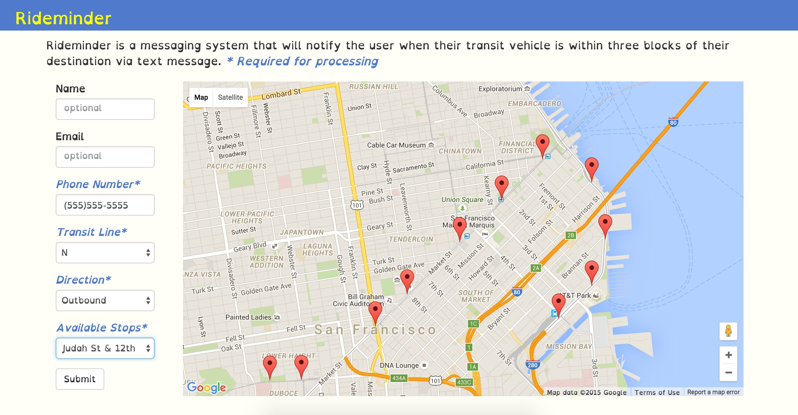

Rideminder
--------


**Description**

Rideminder is a messaging system that will notify user when their transit vehicle is within three blocks of their destination via text message in San Fransisco. 


### Screenshots

**Submit Request**
(https:// https://github.com/chatasweetie/Transit-Alert/blob/master/static/Rideminder.jpg)




### Technology Stack

**Application:** Python, Flask, Jinja, SQLAlchemy, Celery, RabbitMQ    
**APIs:** Firebase, Google Map, Twilio  
**Front-End**: HTML/CSS, Bootstrap, JQuery, JavaScript, AJAX    

### How to run Awesome_Name locally

Create a virtual environment 

```
> virtualenv env
> source env/bin/activate
```

Install the dependencies

```
> pip install -r requirements.txt
```

Run the app 

```
> cd cd rabbitmq_server-3.5.6/
> sbin/rabbitmq-server 
```

New terminal 
```
> celery worker -l info --beat
```

New Terminal 
```
> python app.py
```


Open your browser and navigate to 

```
http://localhost:5000/
```

Note: The messaging functionality requires that you have a Twilio account id, authorization token and phone number set as local environment variables:

```
TWILIO_ACCOUNT_SID
TWILIO_AUTH_TOKEN
TWILIO_NUMBER
```

Note: Rideminder can be modified to provide service for many large cities that Firebase support. For the complete list go to:

Firebase Data Sets: Transit https://publicdata-transit.firebaseio.com/

