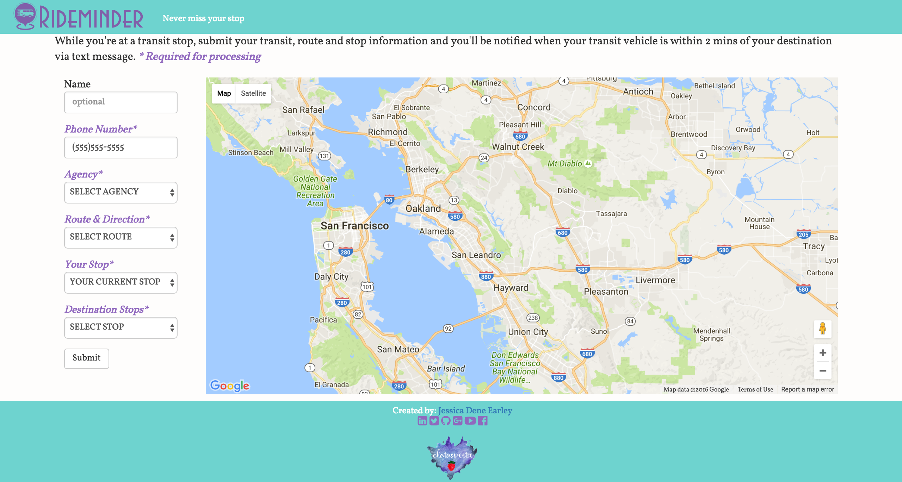
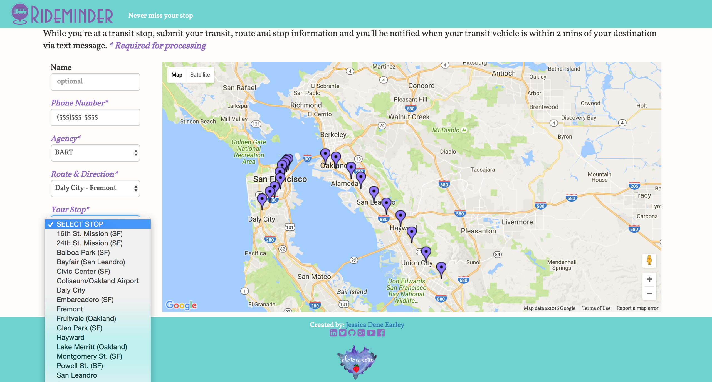

Rideminder
--------
[Rideminder](http://rideminder.herokuapp.com)

**Description**

Rideminder is a messaging system that notifies user when they are within 2 mins of their destination via text message. 

For full details on the process of creating this web app: [Rideminder](https://chatasweetie.wordpress.com/category/rideminder/)    

**How it works**

User inputs their information, trainsit agency, line and stops and they reiceve a confirmation page. The server takes this data and makes an API call to Google Map Direction to get an estimated time of arrival. It then puts the provided information into a Postgres Database.

The Celery worker (celery is an asynchronous task queue/job queue based on distributed message passing) pulls request that have not been completed from my database every minute. It checks the transit vehicle's current location if it is within ½ a mile of the user’s destination. It also checks the datetime object if the estimated time is within 3 mins. If either of these conditions are satisfied, it sends a text message to the user using Twilio.  


### Screenshot

**Submit Request**



**Markers**



**Thank You**


### Technology Stack

**Application:** Python, Flask, Jinja, SQLAlchemy, Celery, RabbitMQ, PostgreSQL    
**APIs:** Google Map, Twilio, Google Map Direction  
**Front-End**: HTML/CSS, Bootstrap, JQuery, JavaScript, AJAX    


### Testing Coverage


### How to run Rideminder locally

Download RabbitMQ server    
https://www.rabbitmq.com/


Create a virtual environment 

```
> virtualenv env
> source env/bin/activate
```

Install the dependencies

```
> pip install -r requirements.txt
```

Run RabbitMQ server

```
> cd rabbitmq_server-3.5.6/
> sbin/rabbitmq-server 
```

In a new terminal run Celery worker
```
> celery worker -l info --beat
```

In a new Terminal run App
```
> python server.py
```


Open your browser and navigate to 

```
http://localhost:5000/
```

Note: The messaging functionality requires that you have a Twilio account id, authorization token and phone number set as local environment variables:

```
TWILIO_ACCOUNT_SID
TWILIO_AUTH_TOKEN
TWILIO_NUMBER
```

Note: Rideminder can be modified to provide service for many large cities that Firebase support. For the complete list go to:

Firebase Data Sets: [Transit](https://publicdata-transit.firebaseio.com/)


### About the Developer    
Jessica Dene Earley    
[Short Bio](https://chatasweetie.wordpress.com/about-me/)   
[Linkedin](https://www.linkedin.com/in/jessicaearley)    
[Blog of Rideminder](https://chatasweetie.wordpress.com/category/rideminder/)     
[Chatasweetie's Blog](https://chatasweetie.wordpress.com/)    
